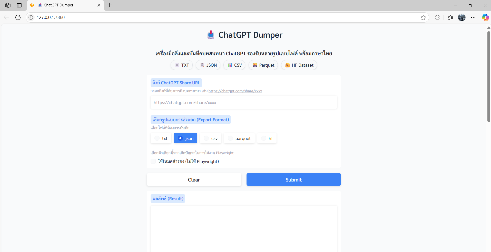
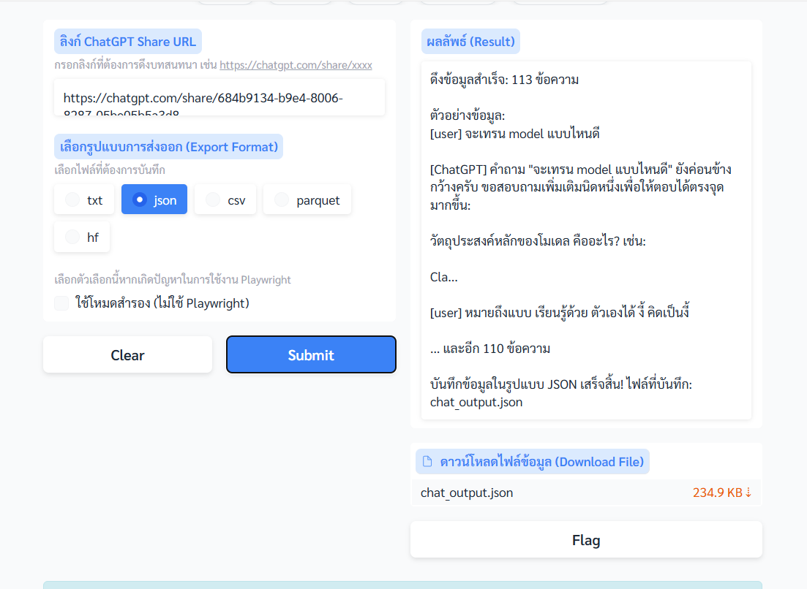
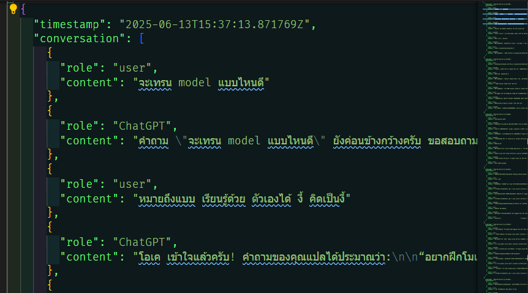

# 📥 ChatGPT Dumper

โปรเจกต์โอเพ่นซอร์สสำหรับดึง (dump) ข้อมูลบทสนทนาจาก ChatGPT ที่แชร์ลิงก์ได้อย่างง่ายดาย รองรับการใช้งานทั้งบนเครื่องส่วนตัว (Local) และ Hugging Face Spaces พร้อมระบบ fallback หาก Playwright ใช้งานไม่ได้

---

## ตัวอย่างหน้าจอการใช้งาน

### 1. หน้าเว็บหลักของ ChatGPT Dumper



> หน้าเว็บหลักของแอปพลิเคชัน ใช้งานง่าย รองรับการเลือกฟอร์แมตไฟล์และโหมดการดึงข้อมูล

### 2. ตัวอย่างผลลัพธ์หลังดึงข้อมูล



> เมื่อดึงข้อมูลสำเร็จ จะแสดงตัวอย่างข้อความและสามารถดาวน์โหลดไฟล์ JSON, CSV, TXT หรือ Parquet ได้ทันที

### 3. ตัวอย่างไฟล์ JSON ที่ได้



> ข้อมูลบทสนทนาจะถูกจัดเก็บในรูปแบบ JSON พร้อม timestamp และแยก role (user/ChatGPT) อย่างชัดเจน

---

## ฟีเจอร์เด่น

- ดึงข้อความบทสนทนา (user/assistant) จากลิงก์แชร์ของ ChatGPT
- รองรับทั้งโหมด Playwright (headless browser) และ fallback (requests + regex)
- ส่งออกข้อมูลเป็นไฟล์ CSV, JSON, Parquet หรือ DataFrame
- มี UI ใช้งานง่ายด้วย Gradio
- รองรับการรันบน Hugging Face Spaces, Docker, หรือเครื่องส่วนตัว

---

## เงื่อนไขการใช้งาน

<ul>
  <li>🚫 ห้ามคัดลอกโค้ด หรือส่วนใดส่วนหนึ่งของระบบ</li>
  <li>🚫 ห้ามแก้ไขหรือดัดแปลง เพื่อสร้างผลงานใหม่</li>
  <li>🚫 ห้ามจำหน่าย หรือแจกจ่ายต่อโดยไม่ได้รับอนุญาต</li>
  <li>✅ อนุญาตให้ใช้งาน เฉพาะเพื่อการทดสอบและเรียนรู้เท่านั้น</li>
</ul>

---

## วิธีติดตั้งและใช้งาน

### 1. ติดตั้ง dependencies

```bash
pip install -r requirements.txt
python -m playwright install chromium
python -m playwright install-deps chromium
```

### 2. รันแอปพลิเคชัน

```bash
python app.py
```

### 3. เปิดใช้งานผ่านเบราว์เซอร์

- เมื่อรันสำเร็จ จะมีลิงก์ Gradio UI ให้ใช้งานผ่านเว็บเบราว์เซอร์

---

## การใช้งานบน Hugging Face Spaces

- รองรับการ deploy อัตโนมัติ (มีไฟล์ `postBuild`, `start.sh`, `run_hf_space.sh`)
- ไม่ต้องตั้งค่าอะไรเพิ่มเติม

---

## การใช้งานผ่าน Docker

```bash
docker build -t chatgpt-dumper .
docker run -p 7860:7860 chatgpt-dumper
```

---

## ตัวอย่างการใช้งาน

1. วางลิงก์แชร์บทสนทนา ChatGPT ลงในช่องกรอก
2. กดปุ่มดึงข้อมูล
3. ดาวน์โหลดไฟล์ผลลัพธ์ในรูปแบบที่ต้องการ (CSV, JSON, Parquet)

---

## รายการ dependencies หลัก

- gradio
- playwright
- pandas
- datasets
- requests
- beautifulsoup4

ดูรายละเอียดทั้งหมดใน `requirements.txt`

---

## เครดิต

- ผู้พัฒนา: [github.com/JonusNattapong](https://github.com/JonusNattapong)

---

> โครงการนี้จัดทำเพื่อช่วยให้การเก็บข้อมูลบทสนทนา ChatGPT เป็นเรื่องง่ายและปลอดภัย